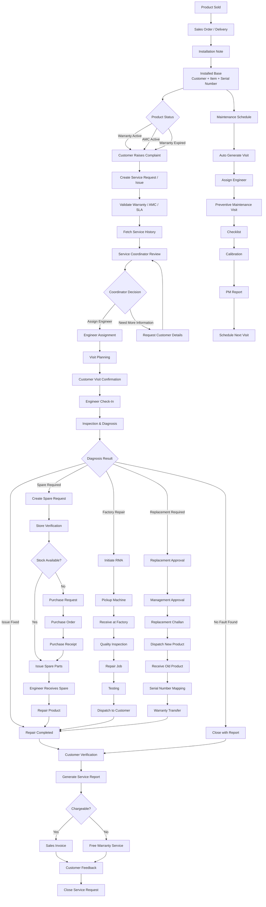

<p align="center">
  
</p>

# SwiftService

SwiftService is an open-source field service management app for Frappe and ERPNext.
It helps service teams run the full service lifecycle from complaint registration to engineer dispatch, on-site resolution, parts management, billing, and closure.

Designed for fast-moving service operations, SwiftService combines a Frappe backend with a dedicated Vue + `frappe-ui` frontend, optimized for both office users and field engineers.

## What SwiftService Solves

- Tracks service requests with complete customer and product context
- Assigns engineers and manages visit planning and follow-up visits
- Supports GPS check-in/check-out, customer pinning, and navigation
- Handles diagnosis, spare part demand, repair, replacement, and return flows
- Connects with ERPNext for inventory movement, invoicing, and payment records

## Highlights

- Single-page app route: `/swiftservice`
- Mobile-friendly engineer workflows
- GPS-based visit check-in / check-out
- Customer pin + navigation support
- Live tracking foundation (periodic live location push + ETA APIs)
- ERPNext integration for stock, invoicing, and payment flows

## End-to-End Service Flow



## Tech Stack

- Backend: Frappe (Python)
- Frontend: Vue 3 + `frappe-ui`
- Map & Geocoding: Google Maps API (preferred), OSM fallback

## Repository Structure

```text
apps/swiftservice/
├── swiftservice/                # Python app (doctypes, APIs, hooks)
├── frontend/                    # Vue frontend source
│   ├── src/
│   └── package.json
├── pyproject.toml
└── README.md
```

## Prerequisites

- Frappe Bench (v16 compatible)
- Node.js + Yarn
- Python 3.14 (as configured in `pyproject.toml`)

## Setup

From your bench root:

```bash
bench get-app <repo_url>
bench install-app swiftservice --site <your-site>
```

## Frontend Build

```bash
cd apps/swiftservice/frontend
yarn install
yarn build
```

Then clear cache:

```bash
cd ~/frappe-bench
bench --site <your-site> clear-cache
```

## Configuration

Open **SwiftService Settings** and configure:

- Brand details (logo/favicon)
- ERP defaults (warehouse/income account/cost center)
- Google Maps API key (for geocoding + ETA/distance)

## Development Workflow

### Run checks

```bash
cd apps/swiftservice
pre-commit install
pre-commit run --all-files
```

Tools used:

- `ruff` (Python lint/format checks)
- `eslint` + `prettier` (frontend)
- `pyupgrade`

### Typical local cycle

```bash
# backend changes
bench restart

# frontend changes
cd apps/swiftservice/frontend && yarn build
bench --site <your-site> clear-cache
```

## Community

- [Contributing Guide](./CONTRIBUTING.md)
- [Code of Conduct](./CODE_OF_CONDUCT.md)
- [Security Policy](./SECURITY.md)

## Notes

- This repo intentionally ignores `frontend/node_modules` and built frontend output.
- Commit source only; generated assets are rebuilt per environment.

## License

GNU General Public License v3.0 (`GPL-3.0`)

See [LICENSE](./LICENSE) for the full text.
